<picture>
  <source media="(prefers-color-scheme: dark)" srcset="https://raw.githubusercontent.com/ViniciusVLM/ViniciusVLM/main/dark.svg">
  <source media="(prefers-color-scheme: light)" srcset="https://raw.githubusercontent.com/ViniciusVLM/ViniciusVLM/main/light.svg">
  
</picture>

 

<picture>
  <source media="(prefers-color-scheme: dark)" srcset="https://raw.githubusercontent.com/ViniciusVLM/ViniciusVLM/output/github-snake-dark.svg" />
  <source media="(prefers-color-scheme: light)" srcset="https://raw.githubusercontent.com/ViniciusVLM/ViniciusVLM/output/github-snake.svg" />
  
</picture>

&nbsp;&nbsp;

&nbsp;&nbsp;

